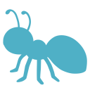

# Kek

[](https://github.com/ubermanu/kek/actions/workflows/tests.yml)

<br>
<p align="center">
    
</p>
<br>

Another small micro framework.

## Install

    composer require ubermanu/kek

## Example

```php
require_once 'vendor/autoload.php';

$app = app();
$app->get('/ping', fn() => 'pong');

echo $app->run()->body; // pong
```
